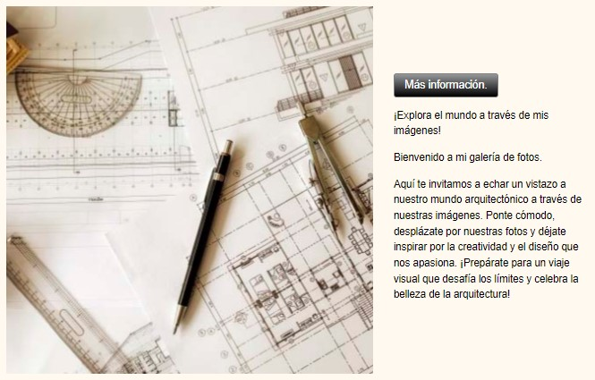
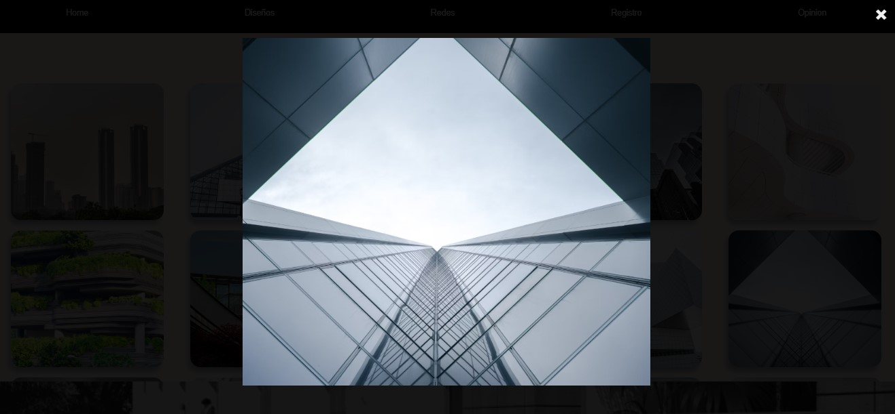
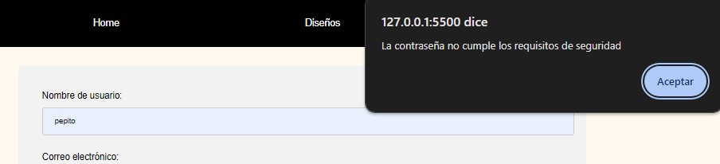
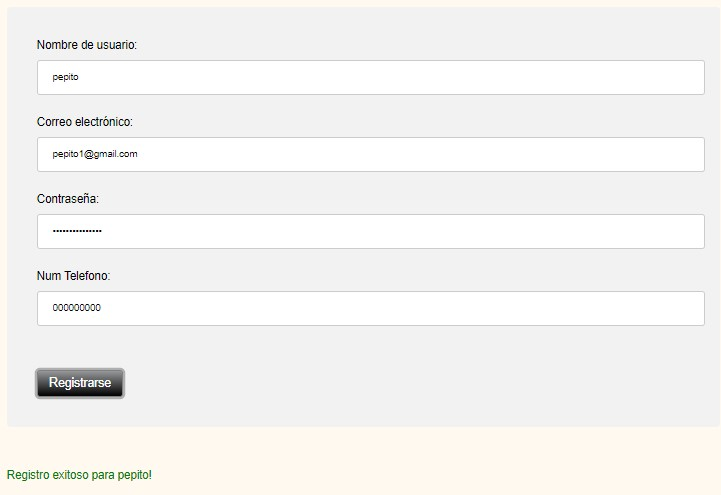
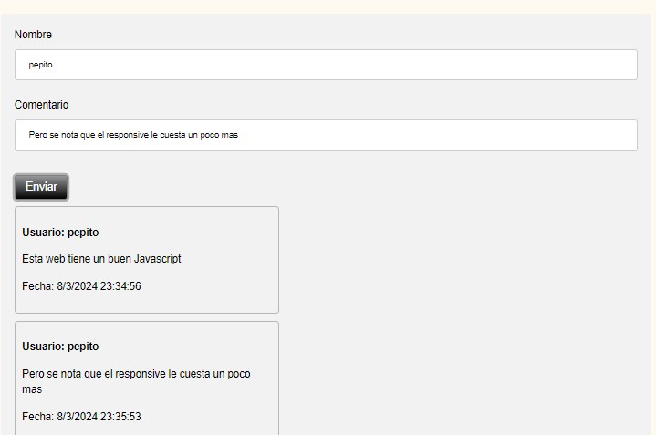

# Documentación de la Página Web

## Estructura de Carpetas y Archivos

La estructura de archivos y carpetas de la página web es la siguiente:

- home.html
- diseño.html
- redes.html
- registro.html
- opinion.html
- style.css
- home.js
- diseño.js
- registro.js
- opinion.js
- img/
   - footer.png
   - img (1).jpg
   - img (2).jpg
   - img (3).jpg
   - img (4).jpg
   - img (5).jpg
   - img (6).jpg
   - img (7).jpg
   - principal.png

## Tecnologías Utilizadas

La página web ha sido desarrollada utilizando las siguientes tecnologías:

- HTML5
- CSS3
- JavaScript
- FontAwesome para iconos
- Git (control de versiones)

## Características y Funcionalidades Principales

La página web presenta las siguientes características y funcionalidades principales:

- **Cabecera (Header):** Contiene un enlace a la página principal y menú de navegación.
- **Contenido Principal:** Páginas individuales como "Home", "Diseños" y "Redes" con contenido específico.
- **Galería de Imágenes:** Presenta imágenes con efectos de hover y redimensionamiento en la sección de "Redes".
- **Pie de Página (Footer):** Imagen de pie de página con tema arquitectonico.

- **Funcionalidades Javascript**

## Capturas de Pantalla

### Boton Ocultar y Mostrar

### Zoom "Mas información" en galería de Imágenes

### Notificaciones emergentes

### Formulario con validacion y mensajes de error emergentes

### Formulario de comentarios
